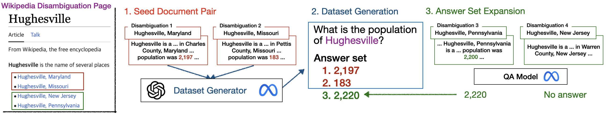

### Dataset Generation
Below explains the pipeline for generating AmbigDocs. We identify a surface name and a list of disambiguated entities from Wikipedia's disambiguation pages. We select two documents for generating a question and their corresponding answers. Subsequently, we gather additional answers from the remaining documents.

  

1. We first gather ambiguous entities and its disambiguations leveraging Wikipedia disambiguation pages. Executing below will use Wikipedia API to search through Wikipedia disambiguation pages and save the relationships between ambiguous entity and its disambiguations in a dictionary.
    ```
    python gather.py
    ```

2. Next, we select two seed documents per ambiguous entity. Excecuting below will iterate the dictionary above. For each ambiguous entity, we compare two documents belonging to distinct disambiugated entities and select one pair that exhibits the highest n-gram overlap. `/src` contains the utility codes for processing the documents, taken from [Contriever repo](https://github.com/facebookresearch/contriever).
    ```
    python seed.py
    ```

3. Next, we generate question and two answers from the seed pairs.

    - Below will generate 1500 questions with GPT-4, followed by filtration process.
        ```
        python generate_gpt.py [openAPI key]
        ``` 
    
    - Below will finetune Llama model with QLoRA on GPT-4 generated questions.
        ```
        finetune_llama.py [path_to_llama_model]
        ``` 
    
    - Below will generate reminaing questions with finetuned Llama model, followed by filtration process.
        ```
        python generate_llama.py [path_to_finetuned_model]
        ``` 
    
4. Finally, we expand the answer set for better coverage. Executing below will expand the answers set, and now we have generated synthetic data!
    ```
    python expand.py [path_to_QA_model]
    ```